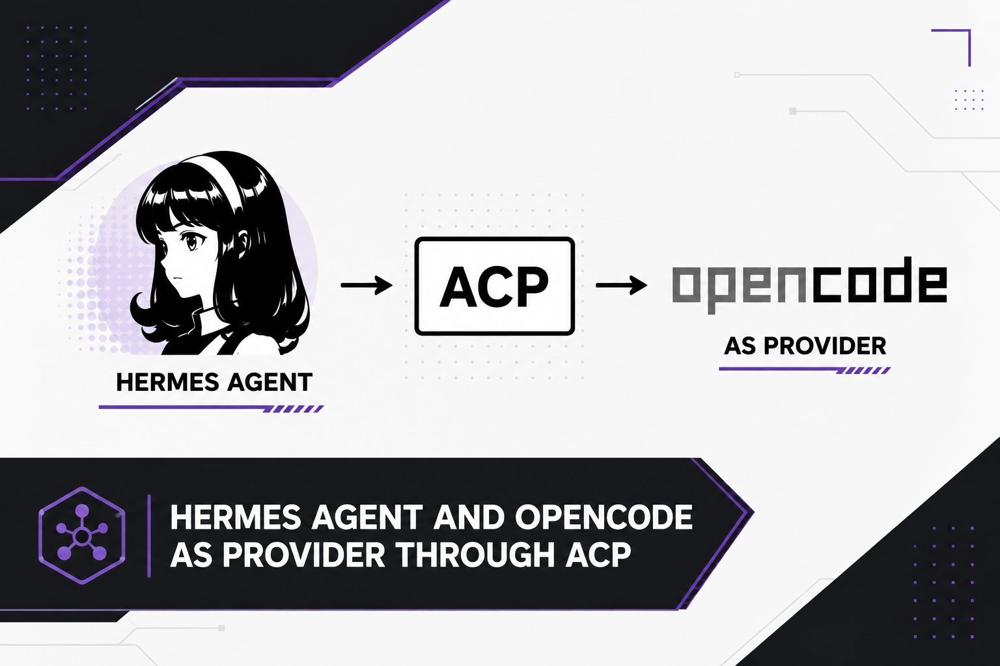

# hermes-opencode-acp

[](https://opensource.org/licenses/MIT)

Use [OpenCode](https://opencode.ai) as a coding agent backend for [Hermes Agent](https://github.com/NousResearch/hermes-agent) via the Agent Client Protocol (ACP).

Connects Hermes to OpenCode via JSON-RPC over stdio. OpenCode handles model selection, tool use, and plugin fallbacks — Hermes drives the ACP wire.

> **⚠️ Early / Experimental** — This is early-stage code and may have bugs. Tested with Hermes Agent on macOS; other platforms or Hermes versions may behave differently. If something breaks, please open an issue. Contributions welcome.

## Features

- **200+ models** — access OpenCode's full catalog (Anthropic, OpenAI, Google, DeepSeek, etc.) without managing API keys individually
- **Full ACP protocol** — initialize, streaming, token estimation, model negotiation
- **Persistent sessions** — one OpenCode process per model, reused across turns (no respawn overhead)

## Use Cases

**1. Access OpenCode's full model catalog**

OpenCode has 200+ models across dozens of providers with built-in auth. No need to manage API keys individually — OpenCode handles it.

**2. Use OpenCode's agentic loop as a provider**

OpenCode has its own tool use, plugin fallbacks, and context management. When Hermes delegates to OpenCode via ACP, it gets all of that for free.

**3. Model flexibility without config sprawl**

Pick any model from OpenCode's catalog as your Hermes model or fallback. `hermes fallback add` now shows the full list — no more guessing model IDs.

**4. Free tier via OpenCode Go**

OpenCode offers free credits for certain models. Run Hermes with free models via OpenCode's Go tier, then fall back to paid when exhausted.

**5. Fallback chain integration**

OpenCode ACP models work in Hermes's fallback chain. If your primary model is rate-limited, try OpenCode models before going to other providers.

## Quick Start

### 1. Install OpenCode CLI

```bash
# macOS
brew install anomalyco/tap/opencode

# npm
npm i -g opencode-ai@latest

# Verify
opencode run 'hello'
```

### 2. Set up OpenCode auth

```bash
opencode auth login
# or set provider env vars (OPENROUTER_API_KEY, etc.)
```

### 3. Install the plugin

```bash
# Clone
git clone https://github.com/jovylle/hermes-opencode-acp.git
cd hermes-opencode-acp

# Copy plugin
cp plugin/opencode_acp_client.py ~/.hermes/hermes-agent/agent/
mkdir -p ~/.hermes/hermes-agent/plugins/model-providers/opencode-acp
cp plugin/opencode_acp_provider.py ~/.hermes/hermes-agent/plugins/model-providers/opencode-acp/__init__.py

# Apply patches
cd ~/.hermes/hermes-agent
git apply /path/to/hermes-opencode-acp/patches/*.patch
```

The `patches/` directory covers **all 14 integration points** (auth, model picker,
runtime helpers, auxiliary client, agent init, conversation loop, shared copilot
client, CLI dispatch, model switch, model catalog, provider overlay, runtime
provider, setup defaults, web dashboard). Keep them in sync with your local
edits by regenerating after any change:

```bash
# Regenerate one patch from the live (patched) tree:
cd ~/.hermes/hermes-agent
git diff -- <path/to/file.py> > /path/to/hermes-opencode-acp/patches/NNN-name.patch
```

### 4. Configure

```bash
# Interactive — shows 200+ models from OpenCode
hermes model
# Pick: OpenCode → OpenCode ACP → select model

# Add to fallback chain
hermes fallback add
# Pick: OpenCode ACP → pick a model
```

### 5. Restart and use

```bash
hermes gateway restart
hermes chat  # works!
```

## Configuration

### Via `hermes model`

```bash
hermes model
# Select: OpenCode → OpenCode ACP
# Shows 200+ models from OpenCode's catalog
```

### Via `config.yaml`

```yaml
model:
  provider: opencode-acp
  model: opencode/deepseek-v4-flash
  base_url: acp://opencode
  api_mode: chat_completions
```

### Via environment variables

```bash
export OPENCODE_BIN=/path/to/opencode
export HERMES_OPENCODE_ACP_COMMAND=/path/to/opencode
export HERMES_OPENCODE_ACP_ARGS="acp"
export OPENCODE_ACP_BASE_URL="acp://opencode"
```

### Fallback chain

```yaml
fallback_providers:
  - provider: opencode-acp
    model: opencode/mimo-v2.5-free
    base_url: acp://opencode
  - provider: opencode-acp
    model: opencode/kimi-k2.6
    base_url: acp://opencode
```

> **Model switching keeps the session (1:1 continuation).**  The client cache
> is keyed by `(command, args, cwd)` — NOT by model.  When Hermes falls back
> to a different model (or you `/model`-switch), the *same* OpenCode process
> and session stay alive and the new model is applied in place via
> `session/set_config_option` (verified live on opencode 1.18.20: the session
> recalls earlier context after the switch).  No fresh process, no history loss.

> **Model picking is ACP-native.**  `/model` and `hermes model` now probe the
> `opencode acp` server itself for its advertised model catalog (the same list
> it validates `session/set_config_option` against) instead of the GitHub
> Copilot catalog.  `opencode models` CLI remains the fallback, then the static
> list.

## Architecture

```
Hermes ──ACP JSON-RPC──> OpenCode ──HTTP──> LLM Provider
  │                          │
  │ persistent process       │ model selection + tools
  │ streaming response       │ plugin fallbacks
```

## Differences from Copilot ACP

| | Copilot ACP | OpenCode ACP |
|---|---|---|
| Binary | `copilot` | `opencode` |
| ACP args | `--acp --stdio` | `acp` |
| Provider slug | `copilot-acp` | `opencode-acp` |
| Base URL marker | `acp://copilot` | `acp://opencode` |
| Auth | Copilot CLI login | OpenCode auth |
| Model selection | GitHub Copilot catalog | OpenCode's config |
| Session persistence | Per-turn (new process) | Persistent (same process) |

## Troubleshooting

**"Could not find the OpenCode CLI command"**
- Install OpenCode: `npm i -g opencode-ai@latest`
- Or set `OPENCODE_BIN=/full/path/to/opencode`

**OpenCode ACP exits immediately**
- Check `opencode run 'hello'` works standalone
- Check OpenCode auth: `opencode providers`

**No streaming text**
- The model may not support streaming via ACP
- Try a different model in OpenCode's config

**Model list not showing**
- Run `opencode models` directly to verify OpenCode CLI works
- If empty, check OpenCode auth with `opencode providers`

## License

MIT
